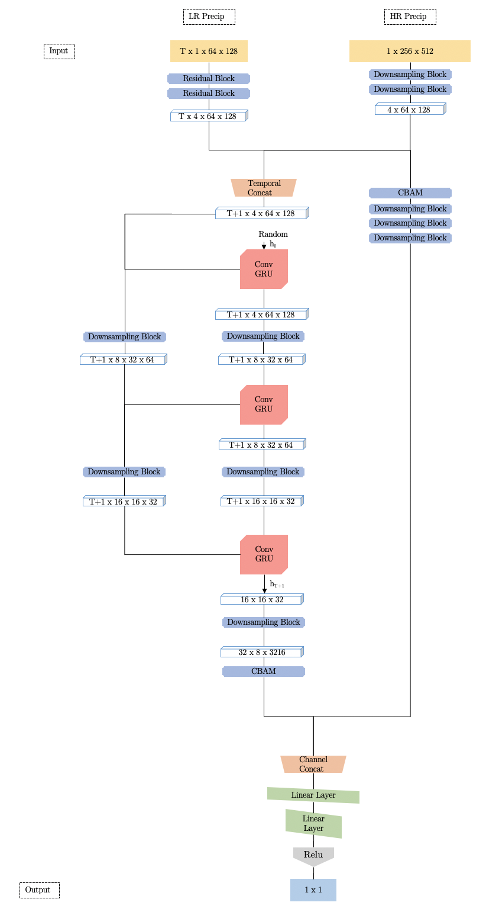

# GRU-DD
Codebase for the model downscaling modeldescribed in my thesis
-------

### Abstract:
Global climate models represent major climate system components of the planet in order to generate long term, sparse, accurate realizations of future climatic events across the entire globe. Downscaling is the method by which these low resolution realizations are converted into high resolution simulations of climate events which can then be used by stakeholders and policy makers. 

Regional climate models dynamically downscale simulated climate by conditioning global climate models on  location-specific physical processes. Although these models are robust and reliable, they are computationally expensive when compared to statistical approaches for modeling a general relationship between global climate behaviour and local climate behavior. Therefore, there is need for downscaling methods that leverage the computational efficiency of statistical models while maintaining the performance of regional climate models.

In this thesis, we build upon previously proposed deep learning methods for dynamical downscaling through estimation of a regional climate model. Our proposed model is a generative adversarial network that leverages the effects of temporal dependencies within spatio-temporal climate events. 

### Model Structure
